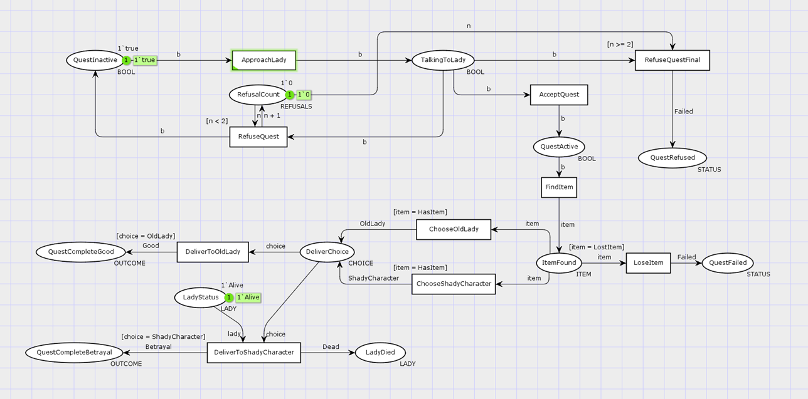
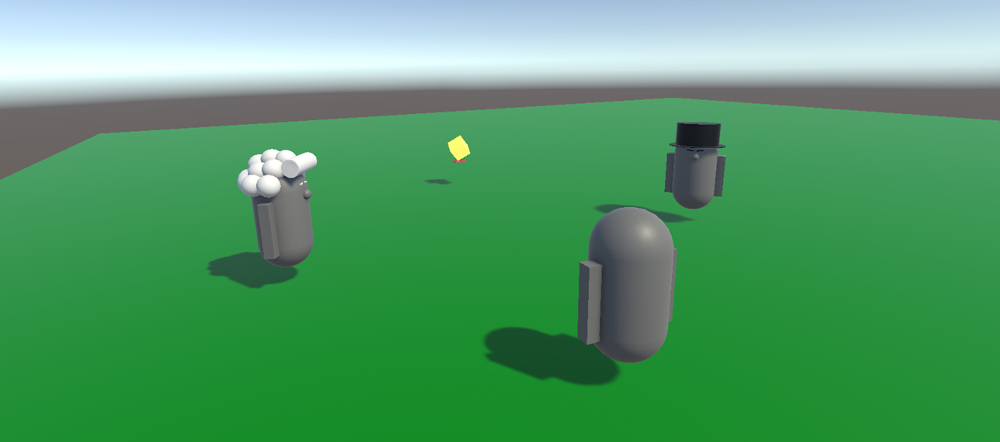

# CPNTools Questline verification

A Software Engineering course semester project where CPNTools were used to 
model a branching questline, checking for deadlocks and other problem states, 
before being implemented in a simple Unity game.

